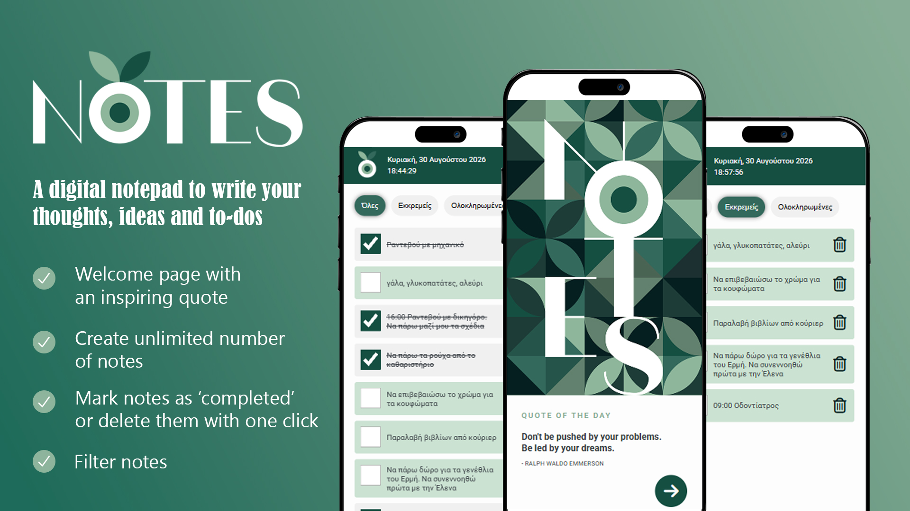

# mini-web-apps
A repository with mini web apps created with **HTML**, **CSS** and **JavaScript**.

[01. Notes](#notes)
[02. ColorFinder](#colorfinder)

## Notes

<ins>Description</ins>

[**Notes**](https://github.com/antoiosif/mini-web-apps/tree/main/02.notes-app) is a web app designed as a digital notepad for the users to write easily and quickly their thoughts, ideas and to-dos in the form of digital notes, helping them to stay organized and manage their tasks effectively.

<ins>Features</ins>

- **Create notes**: Users are allowed to create an unlimited number of notes with up to 150 characters each. There is a character counter that shows in real time the number of characters typed, so that the user can know when the above limit has been reached.
- **Mark notes as completed**: User’s notes appear as a handy checklist where just one click marks a note as “completed” or unmarks it. The appearance of the “completed” note changes to easily differentiate it from the other notes.
- **Delete notes**: Users can permanently delete a note with one click.
- **Filtering**: Notes can be filtered by their status (“all”, “pending”, “completed”) for quicker access.
- **User-Friendly interface**: Simple design that ensures a seamless user experience.
- **Inspiring quotes**: Every time the user enters the app, a quote from a list of inspiring, motivational and thought-provoking quotes appears on the screen.
- **Storage**: It uses local storage to save permanently the notes.

<ins>Tech stack</ins>

**HTML** - **CSS** - **JavaScript**

## ColorFinder
https://github.com/user-attachments/assets/565ecb27-830f-4a2c-804c-4aef30dbc88d

<ins>Description</ins>

[**ColorFinder**](https://github.com/antoiosif/mini-web-apps/tree/main/02.color-finder-app) is a web app for generating colors in RGB mode, HEX mode or named HTML colors.

Every time users click the **CLICK ME!** button a new color is generated. The background of the viewport changes to this color and its value appears in the color tag for the users to copy and use it in their digital projects.

<ins>Features</ins>

- **3 different color modes** for the users to choose from.
- **Simple and minimal design** that ensures a seamless user experience.
- **Responsive design** for a consistent and optimal user experience across various screen sizes and devices (desktops, tablets, mobile phones).

<ins>Tech stack</ins>

**HTML** - **Bootstrap** - **jQuery**